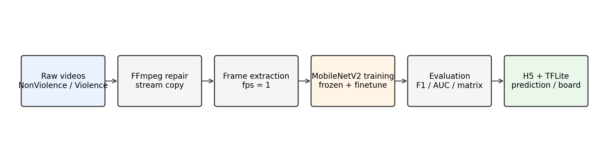
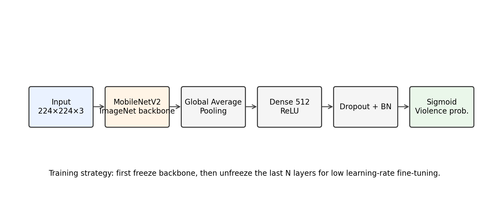
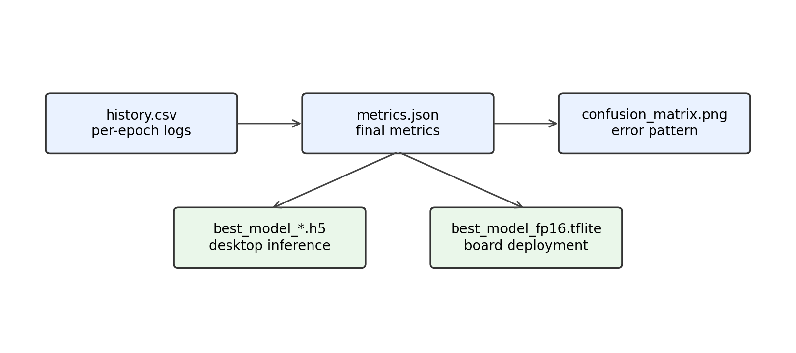

<div align="center">

# 🛡️ 校园暴力视频识别

基于视频抽帧与 MobileNetV2 的二分类实验项目，覆盖视频修复、抽帧、数据检查、模型训练、评估、预测和 TFLite 导出。


</div>

## ✨ 项目概览

本仓库实现了一套校园暴力视频识别实验流程。原始视频按类别整理后，先通过 FFmpeg 进行无损封装修复，再按固定帧率抽帧，最后使用 MobileNetV2 训练二分类模型。

默认类别如下：

| 类别目录 | 含义 |
| --- | --- |
| `NonViolence` | 非暴力片段 |
| `Violence` | 暴力片段 |

项目重点是把完整流程整理清楚：数据如何组织、命令如何运行、结果如何保存、模型如何预测。代码结构尽量保持简单，方便复现实验和继续扩展。

## 🎯 项目范围

本项目属于课程实验或比赛原型项目，不是可以直接上线的实时安防系统。

当前版本主要完成：

- 视频文件修复；
- 视频按帧抽取；
- 抽帧数据检查；
- MobileNetV2 二分类训练；
- 验证集评估与指标导出；
- 单张图片、单个视频和 TFLite 模型推理。

## 📌 处理流程

<p align="center">
  
</p>

```text
Raw Videos
    │
    ├── FFmpeg Remux
    │
    ├── Frame Extraction
    │
    ├── Dataset Check
    │
    └── MobileNetV2 Training
            │
            ├── Evaluation Metrics
            ├── Training Curves
            ├── H5 Model
            └── TFLite Model
```

## 🧠 模型结构

<p align="center">
  
</p>

模型以 MobileNetV2 作为特征提取主干，并接入一个轻量二分类头：

```text
Input(224×224×3)
  → MobileNetV2(include_top=False)
  → GlobalAveragePooling2D
  → Dense(512, ReLU)
  → Dropout(0.5)
  → BatchNormalization
  → Dense(1, Sigmoid)
```

训练分为两个阶段：

1. 冻结 MobileNetV2 主干，只训练分类头；
2. 解冻主干尾部若干层，用更小学习率微调。

这种训练方式比直接全量训练更稳定，也更适合中小规模数据集。

## 📁 目录结构

```text
campus-violence-detection/
├── assets/                      # README 和文档用图
├── configs/                     # 训练配置记录模板
├── data/                        # 本地数据目录，真实数据不纳入仓库
│   ├── raw/                     # 原始视频
│   ├── fixed/                   # 修复后视频
│   └── frames/                  # 抽帧图片
├── docs/                        # 实验报告、设计说明、部署记录
├── results/                     # 示例输出格式
├── runs/                        # 训练输出，默认忽略
├── scripts/                     # 命令行入口
├── src/violence_detection/      # 核心代码
├── tests/                       # 轻量检查
├── Makefile
├── requirements.txt
└── README.md
```

## ⚙️ 环境准备

推荐使用 Python 3.9。

```bash
conda create -n campus_violence python=3.9 -y
conda activate campus_violence
pip install -r requirements.txt
```

还需要安装 FFmpeg，并确认命令行能够识别：

```bash
ffmpeg -version
```

Windows 环境下如果提示找不到 `ffmpeg`，需要把 `ffmpeg.exe` 所在目录加入系统 Path。

## 🗂️ 数据准备

原始视频按类别放到 `data/raw`：

```text
data/raw/
├── NonViolence/
│   ├── video_001.mp4
│   └── ...
└── Violence/
    ├── video_101.mp4
    └── ...
```

真实视频、抽帧图片、模型权重和训练日志默认不会提交。公开项目时，可在文档中写明数据来源、下载方式和预处理流程。

## 🚀 快速运行

### 🧹 1. 修复视频

```bash
python scripts/fix_videos.py --input data/raw --output data/fixed
```

这一步用于处理部分视频封装不规范的问题。底层使用 FFmpeg stream copy，不重新编码。

### 🎞️ 2. 抽帧

```bash
python scripts/extract_frames.py --input data/fixed --output data/frames --fps 1
```

如果视频本身没有封装问题，也可以直接从原始目录抽帧：

```bash
python scripts/extract_frames.py --input data/raw --output data/frames --fps 1
```

抽帧后的结构如下：

```text
data/frames/
├── NonViolence/
│   └── video_001/
│       ├── frame_000001.jpg
│       └── ...
└── Violence/
    └── video_101/
        ├── frame_000001.jpg
        └── ...
```

### ✅ 3. 检查数据

```bash
python scripts/check_dataset.py --data data/frames
```

确认两个类别都包含有效图片后再训练。类别数量差距较大时，可在训练阶段启用 `--use-class-weight`。

### 🏋️ 4. 训练模型

```bash
python scripts/train.py --data data/frames --out runs/mobilenetv2 --export-tflite
```

常用完整命令：

```bash
python scripts/train.py \
  --data data/frames \
  --out runs/mobilenetv2 \
  --image-size 224 \
  --batch-train 8 \
  --batch-val 32 \
  --frozen-epochs 10 \
  --finetune-epochs 8 \
  --unfreeze-layers 40 \
  --export-tflite
```

显存不足时，可以先把 `--batch-train` 调小，例如 4 或 2。

### 📊 5. 查看训练结果

训练完成后，重点查看以下文件：

<p align="center">
  
</p>

```text
runs/mobilenetv2/
├── best_model_frozen.h5
├── best_model_finetuned.h5
├── best_model_fp16.tflite
├── class_indices.json
├── metrics.json
├── history.csv
├── loss_curve.png
├── accuracy_curve.png
├── auc_curve.png
├── confusion_matrix.png
└── logs/
```

也可以打开 TensorBoard 查看训练日志：

```bash
tensorboard --logdir runs/mobilenetv2/logs
```

### 🖼️ 6. 单张图片预测

```bash
python scripts/predict_image.py \
  --model runs/mobilenetv2/best_model_finetuned.h5 \
  --class-indices runs/mobilenetv2/class_indices.json \
  --image path/to/image.jpg
```

### 🎬 7. 单个视频预测

```bash
python scripts/predict_video.py \
  --model runs/mobilenetv2/best_model_finetuned.h5 \
  --class-indices runs/mobilenetv2/class_indices.json \
  --video path/to/video.mp4 \
  --fps 1
```

视频预测会先临时抽帧，再对所有帧的暴力概率求平均。该方式适合离线判断，不等同于实时监控。

### 📱 8. TFLite 推理

```bash
python scripts/predict_tflite.py \
  --model runs/mobilenetv2/best_model_fp16.tflite \
  --class-indices runs/mobilenetv2/class_indices.json \
  --image path/to/image.jpg
```

## ⚙️ 命令行参数

| 参数 | 默认值 | 说明 |
| --- | ---: | --- |
| `--data` | 必填 | 抽帧后的数据目录 |
| `--out` | `runs/mobilenetv2` | 训练输出目录 |
| `--image-size` | `224` | 输入图片尺寸 |
| `--batch-train` | `8` | 训练 batch size |
| `--batch-val` | `32` | 验证 batch size |
| `--validation-split` | `0.2` | 验证集比例 |
| `--frozen-epochs` | `10` | 冻结主干训练轮数 |
| `--finetune-epochs` | `8` | 微调轮数 |
| `--unfreeze-layers` | `40` | 微调时解冻的主干尾部层数 |
| `--lr-frozen` | `0.001` | 冻结阶段学习率 |
| `--lr-finetune` | `0.00001` | 微调阶段学习率 |
| `--use-class-weight` | 关闭 | 类别不均衡时启用 |
| `--export-tflite` | 关闭 | 导出 FP16 TFLite 模型 |
| `--no-plots` | 关闭 | 不保存曲线图和混淆矩阵图 |

## 📈 结果记录

训练后可从 `runs/mobilenetv2/metrics.json` 提取以下指标：

| 字段 | 含义 |
| --- | --- |
| `loss` | 验证集损失 |
| `accuracy` | 验证集准确率 |
| `auc` | Keras 评估得到的 AUC |
| `precision` | 暴力类查准率 |
| `recall` | 暴力类召回率 |
| `f1` | F1 分数 |
| `confusion_matrix` | 混淆矩阵 |

示例输出格式见 `results/example_output.txt` 和 `results/example_metrics.json`。正式报告应使用实际运行结果替换示例数字。

## 📝 文档

- [`docs/DESIGN_NOTES.md`](docs/DESIGN_NOTES.md)：代码和模型设计说明；
- [`docs/EXPERIMENT_REPORT.md`](docs/EXPERIMENT_REPORT.md)：实验报告模板；
- [`docs/dataset.md`](docs/dataset.md)：数据目录和抽帧说明；
- [`docs/kunpeng_pro_deployment.md`](docs/kunpeng_pro_deployment.md)：Orange Pi Kunpeng Pro 部署记录；
- [`docs/git_lfs.md`](docs/git_lfs.md)：大文件管理说明。

## 🧰 Makefile 用法

Linux、macOS 或 Git Bash 下可以直接使用：

```bash
make install
make fix
make extract
make train
```

Windows PowerShell 环境下也可以直接执行前文列出的 Python 命令。

## ⚠️ 限制说明

- 本项目只能作为实验项目使用，不能直接作为校园安全系统上线；
- 视频级标签和帧级标签不完全等价，抽帧训练会引入一定噪声；
- 如果数据来自公开数据集或比赛平台，需要检查数据许可；
- 准确率不是唯一指标，暴力识别任务还需要关注召回率、误报和漏报。
